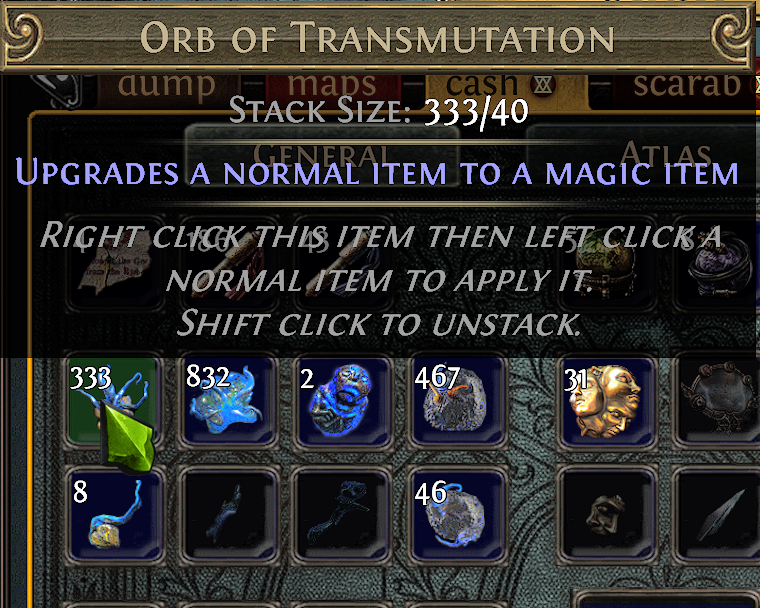
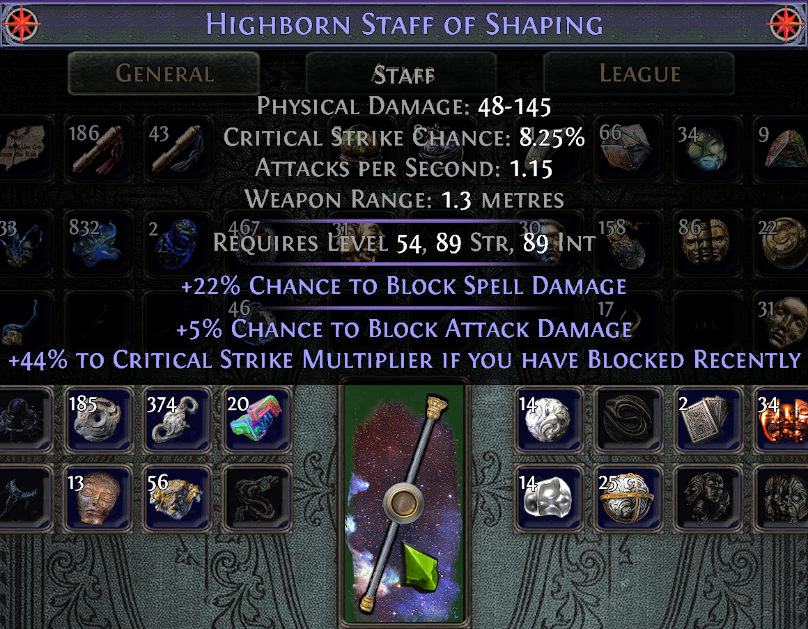
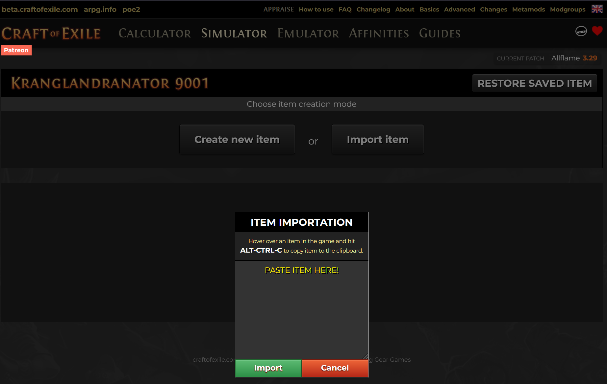
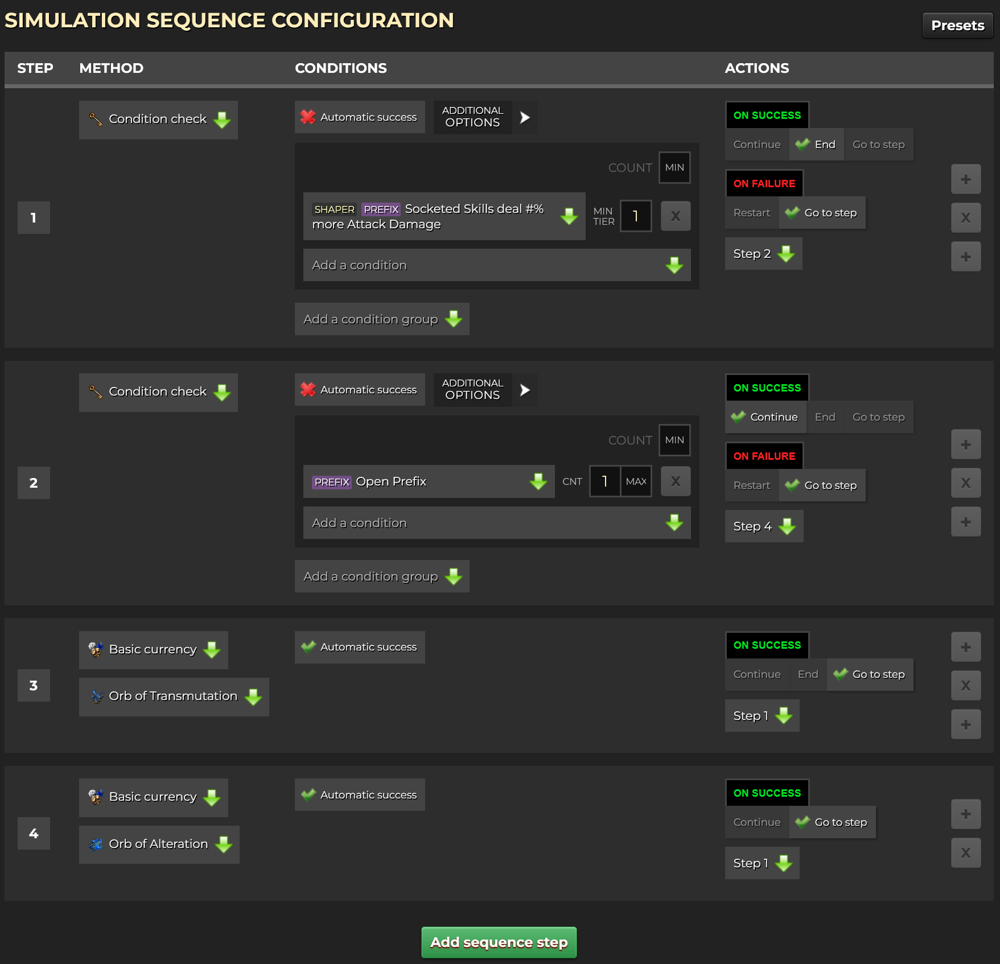
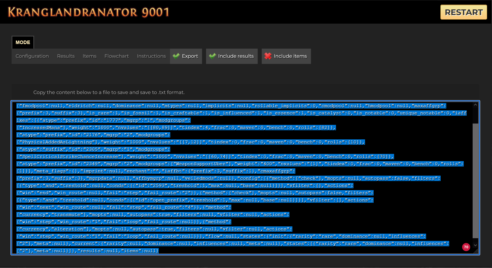

# Auto Craft of Exile

Automatically executes a [Craft of Exile](https://www.craftofexile.com/?game=poe1) Simulator recipe in [Path of Exile](https://www.pathofexile.com/).

> [!WARNING]
> Auto Craft of Exile controls the mouse and keyboard. Remain at the computer, keep the stop hotkey available, and test new recipes with inexpensive materials first.

## Installation

Python 3.14 or newer is required.

```bash
pip install autocraftofexile
autocraftofexile --help
```

Run an exported recipe explicitly:

```bash
autocraftofexile --recipe ./recipe_export_from_craft_of_exile.json
```

If no recipe path is supplied, the application uses its default recipe location.

## First-time setup

During first-time setup, Auto Craft of Exile asks for the screen positions of every crafting component required by the recipe.

> [!IMPORTANT]
> Keep the Auto Craft of Exile terminal focused while answering setup prompts. Do not click or use <kbd>Alt</kbd>+<kbd>Tab</kbd> to focus Path of Exile unless a prompt explicitly asks you to interact with it.

For each required currency or component, hover its stash position and press <kbd>Enter</kbd>:

```text
Move mouse to the Orb of Transmutation and press ENTER.
```



The setup then records the position of the item being crafted:

```text
Move mouse to the Item Showcase and press ENTER.
```



Finally, press the desired start and stop key combinations. The first detected combination is stored.

```text
Press the start hotkey.
start hotkey: f9

Press the stop hotkey.
stop hotkey: f10
```

The setup is written to `data/gui.json`. Run setup again or remove that file if the game window, display scaling, stash layout, or crafting positions change.

## How it works

For every recipe step, Auto Craft of Exile:

1. applies the step's crafting method to the configured item position;
2. copies the resulting item data from Path of Exile;
3. evaluates the step's filters locally;
4. follows the recipe until a step passes or the recipe terminates.

The application does not modify the game client or communicate with the game process. It automates configured screen positions and reads item text copied to the clipboard. Moving the game window, changing the UI layout, or covering the relevant inventory positions can therefore make a configured action unsafe or inaccurate.

## Example recipes

New users should start with one of the ready-made recipes in the repository's [`data/` directory](https://github.com/ProphetLamb/autocraftofexile/tree/main/data). They are useful both as working recipes and as references for exported methods, filters, conditions, and routes.

- [`recipe_5link.json`](https://github.com/ProphetLamb/autocraftofexile/blob/main/data/recipe_5link.json): create a five-linked item.
- [`recipe_5socket.json`](https://github.com/ProphetLamb/autocraftofexile/blob/main/data/recipe_5socket.json): create an item with five sockets.
- [`recipe_6link.json`](https://github.com/ProphetLamb/autocraftofexile/blob/main/data/recipe_6link.json): create a six-linked item.
- [`recipe_6socket.json`](https://github.com/ProphetLamb/autocraftofexile/blob/main/data/recipe_6socket.json): create an item with six sockets.
- [`recipe_example.json`](https://github.com/ProphetLamb/autocraftofexile/blob/main/data/recipe_example.json): a broader reference demonstrating the supported recipe structure.
- [`recipe_flask_inc_effect.json`](https://github.com/ProphetLamb/autocraftofexile/blob/main/data/recipe_flask_inc_effect.json): craft a flask for increased effect.
- [`recipe_staff_str_stacker_alt_spam.json`](https://github.com/ProphetLamb/autocraftofexile/blob/main/data/recipe_staff_str_stacker_alt_spam.json): use alteration crafting for a strength-stacking staff.
- [`recipe.json`](https://github.com/ProphetLamb/autocraftofexile/blob/main/data/recipe.json): the repository's default recipe file.

After cloning the repository, run an example by passing its local path:

```bash
autocraftofexile --recipe ./data/recipe_5link.json
```

> [!IMPORTANT]
> Review every example in Craft of Exile before running it. Confirm that it suits your base item, all required currencies are visible at their configured positions, and you understand its success and failure routes. Example recipes can consume substantial currency and are not safe defaults for every item.

## How to use

### 1. Copy the base item

Hover the item in Path of Exile and copy its detailed item data using <kbd>Ctrl</kbd>+<kbd>Alt</kbd>+<kbd>C</kbd>.


### 2. Import the base item into Craft of Exile



### 3. Compose the recipe

Create the sequence of crafting methods and result conditions that should be executed.



### 4. Validate and export the recipe

Run the recipe in the simulator first. When it behaves as expected, export it to `data/recipe.json`, or pass another path with `--recipe`.



### 5. Start Auto Craft of Exile

```bash
pip install autocraftofexile
autocraftofexile
```

Useful command-line options include:

```text
╭─ Options ────────────────────────────────────────────────────────────────────────────────────────────────────────────────────╮
│ --speed                       <int>  The number of actions per second [default: 60]                                          │
│ --poecd                       <str>  Path to the pocd.json file                                                              │
│ --recipe                      <str>  Path to the recipe.json file                                                            │
│ --gui                         <str>  Path to the gui.json file                                                               │
│ --log                         <str>  Path to the log file                                                                    │
│ --install-completion                 Install completion for the current shell.                                               │
│ --show-completion                    Show completion for the current shell, to copy it or customize the installation.        │
│ --help                -h             Show this message and exit.                                                             │
╰──────────────────────────────────────────────────────────────────────────────────────────────────────────────────────────────╯

```

> [!TIP]
> Start with the default speed and lower it if Path of Exile misses input, the clipboard contains stale item text, or the client has not finished rendering an item change.

### How `--speed` behaves

`--speed` is a timing scale, not a strict limit on complete crafting steps per second. Higher values shorten mouse movement, click, keyboard, and clipboard delays. Lower values make every automated interaction slower.

The default is `60`. Internally, the setting affects actions as follows:

- mouse travel duration is approximately 4 to 6 divided by `speed` seconds;
- click duration is approximately 1 divided by `speed` seconds;
- waits after pressing or releasing a key are approximately 1 divided by `speed` seconds;
- the interval between keys in a hotkey is approximately 1 divided by the number of keys and `speed`;
- after copying an item, the application waits approximately 1 divided by `speed` seconds before reading the clipboard.

Each duration is randomized by about 15 percent. Mouse coordinates are also randomized by up to four pixels in each direction. These variations make interactions less mechanically uniform, so observed timings will not be exact.

For example, at the default speed of `60`, a mouse movement normally takes about 67 to 100 milliseconds before random variation, while a click or clipboard wait is about 17 milliseconds. At speed `20`, the same operations take roughly three times as long. One crafting step includes multiple operations, so `--speed 60` does **not** mean 60 completed crafts per second.

> [!WARNING]
> Values that are too high can cause missed clicks, stale clipboard reads, or an unchanged-item error. The application checks that item-changing methods actually changed the copied item and stops when they did not. There is no benefit to choosing a speed faster than the game client and clipboard can process reliably.

Examples:

```bash
# Default timing
autocraftofexile --speed 60

# More conservative timing for a slower client or remote desktop
autocraftofexile --speed 20
```

`speed` must be greater than zero. A zero value currently falls back to `60` at startup, while a negative value can produce invalid GUI timings and should not be used.

## Begin crafting

Before starting:

- open Path of Exile;
- open the stash tab containing every required crafting component;
- place the base item at the configured item position;
- verify that all configured currency positions are visible and contain enough currency;
- make sure the game window and UI scale match the setup;
- keep the stop hotkey available.

Activate crafting with the configured start hotkey, for example <kbd>F9</kbd>. Use the stop hotkey, for example <kbd>F10</kbd>, to request termination.

> [!CAUTION]
> Do not move the mouse, switch windows, move stash items, or change tabs while a recipe is running. Automation uses absolute screen positions and cannot tell whether a different item or control has moved beneath the cursor.

## Supported crafting methods

A recipe step identifies its method using an ordered signature exported by Craft of Exile. Signatures are matched case-insensitively, but every component must otherwise match a registered method exactly. The application validates the complete recipe against `DEFAULT_CRAFTER_METHODS` before crafting begins.

There are three categories of supported methods:

- **check**, which reads and evaluates the item without changing it;
- **click**, which clicks the configured showcase position;
- **currency**, which selects a configured currency and applies it to the showcase item.

### Check

Signature:

```text
check
```

The check method does not click the item and reports that no item change is expected. It copies the current showcase item and evaluates the step's filters. This is useful for branching based on the initial item or checking the result of an earlier action without spending currency.

The method is included in execution statistics but omitted from the displayed **Crafting Costs** table because it consumes no crafting material.

### Click methods

Supported signatures:

```text
click, left_click
click, right_click
```

- `left_click` performs one left click at the current showcase position.
- `right_click` performs one right click at the current showcase position.

Both methods are treated as item-changing actions. After either click, Auto Craft of Exile copies the item and verifies that it differs from the previously cached item. If the copied item did not change, execution stops with `Crafting method unexpectedly left the item unchanged`.

These methods do not select a currency. Their exact in-game effect depends on the item or object currently associated with the configured showcase position.

### Currency methods

Currency methods right-click the configured currency position, move to the showcase item, hold <kbd>Shift</kbd>, and left-click the item. Holding Shift allows repeated use of the selected currency.

If the next step uses the same currency signature, the application keeps that currency selected and performs another left click. When the signature changes, it releases Shift, selects the newly required currency, moves back to the showcase, holds Shift again, and applies it. Shift is released when the crafter exits, including when execution is cancelled or fails.

Every supported signature and GUI coordinate is listed below.

#### Orb of Transmutation

```text
currency, transmute
```

Uses the `transmute` coordinate. Applies an Orb of Transmutation to the showcase item.

#### Orb of Augmentation

```text
currency, augmentation, augmentation_normal
currency, augmentation, <null>
```

Both signatures use the `augment` coordinate and perform the same GUI action. The `<null>` entry represents a missing third signature component in the exported recipe, not the literal string `"null"`.

#### Orb of Alteration

```text
currency, alteration
```

Uses the `alteration` coordinate.

#### Regal Orb

```text
currency, regal, regal_normal
currency, regal, <null>
```

Both signatures use the `regal` coordinate and perform the same GUI action.

#### Orb of Alchemy

```text
currency, alchemy
```

Uses the `alchemy` coordinate.

#### Chaos Orb

```text
currency, chaos
```

Uses the `chaos` coordinate.

#### Exalted Orb

```text
currency, exalted, exalted_normal
currency, exalted, <null>
```

Both signatures use the `exalt` coordinate and perform the same GUI action.

#### Orb of Scouring

```text
currency, scour
```

Uses the `scour` coordinate.

#### Orb of Annulment

```text
currency, annul
```

Uses the `annul` coordinate.

#### Orb of Fusing

```text
currency, fusing, fusing_normal
currency, fusing, <null>
```

Both signatures use the `fusing` coordinate and perform the same GUI action.

#### Jeweller's Orb

```text
currency, jeweller, jeweller_normal
currency, jeweller, <null>
```

Both signatures use the `jeweller` coordinate and perform the same GUI action.

### Currency method reference

| Craft of Exile signature | Currency | `GuiConfig` coordinate |
|---|---|---|
| `currency, transmute` | Orb of Transmutation | `transmute` |
| `currency, augmentation, augmentation_normal` | Orb of Augmentation | `augment` |
| `currency, augmentation, <null>` | Orb of Augmentation | `augment` |
| `currency, alteration` | Orb of Alteration | `alteration` |
| `currency, regal, regal_normal` | Regal Orb | `regal` |
| `currency, regal, <null>` | Regal Orb | `regal` |
| `currency, alchemy` | Orb of Alchemy | `alchemy` |
| `currency, chaos` | Chaos Orb | `chaos` |
| `currency, exalted, exalted_normal` | Exalted Orb | `exalt` |
| `currency, exalted, <null>` | Exalted Orb | `exalt` |
| `currency, scour` | Orb of Scouring | `scour` |
| `currency, annul` | Orb of Annulment | `annul` |
| `currency, fusing, fusing_normal` | Orb of Fusing | `fusing` |
| `currency, fusing, <null>` | Orb of Fusing | `fusing` |
| `currency, jeweller, jeweller_normal` | Jeweller's Orb | `jeweller` |
| `currency, jeweller, <null>` | Jeweller's Orb | `jeweller` |

> [!NOTE]
> Method variants that share a coordinate currently perform the same GUI action. They are registered separately because Craft of Exile can export more than one signature for the same normal currency operation.

### Item-change verification

`left_click`, `right_click`, and every currency method return that they expect the item to change. Auto Craft of Exile then:

1. clears the current parsed-item cache;
2. copies the showcase item with <kbd>Ctrl</kbd>+<kbd>Alt</kbd>+<kbd>C</kbd>;
3. parses the copied text;
4. compares the item with the previously cached item;
5. stops if the item is unchanged.

`check` is the only built-in method that does not require an item change.

This protects against an empty currency stack, an inapplicable currency, an incorrect coordinate, a missed click, or a client that did not update quickly enough. It can also stop a valid action when the resulting item serialization is genuinely identical, so inspect the log and reduce `--speed` before retrying.

### Unsupported methods

The current release does **not** provide generic handlers for every method available in Craft of Exile. Fossils, essences, harvest crafts, bench crafts, beastcrafting, eldritch currencies, awakened currencies, and other specialized systems are unsupported unless their exact signature is added to `DEFAULT_CRAFTER_METHODS` in a later release.

When a recipe contains an unregistered signature, validation reports the method before automation begins. If an unsupported method nevertheless reaches execution, the crafter stops with an error containing the step index and method signature. It never substitutes a similar currency automatically.

## Recipes

Auto Craft of Exile consumes the JSON recipe exported by Craft of Exile. Editing the export by hand is not recommended because method identifiers, modifier identifiers, thresholds, and ranges are interpreted according to the Craft of Exile data file.

Conceptually, a recipe contains:

- recipe data describing the base item and simulator context;
- an ordered sequence of crafting steps;
- a crafting method for each step;
- optional filters that determine whether the resulting item passes;
- conditions inside each filter;
- optional numeric bounds and thresholds.

After applying a step, Auto Craft of Exile parses the copied item, evaluates its filters in order, and records which conditions and modifiers matched. Invalid filter types, unsupported conditions, and unsupported crafting methods fail validation or raise an explicit error rather than silently passing.

### Filters and operators

The supported filter operators are case-insensitive:

- **`and`**: the current accumulated result and the filter must both pass.
- **`not`**: the filter result is negated, then combined with the accumulated result.
- **`or`**: succeeds when the result accumulated so far already passes or when the current filter passes. Evaluation can stop early once the accumulated result is successful.

Filters are evaluated in export order, so operator order matters. Keep related conditions together and verify non-trivial combinations in the Craft of Exile simulator before exporting.

Within one filter, every condition is evaluated and the number of successful conditions is counted:

- when `treshold` is absent, every condition must pass;
- when `treshold` is present, at least that many conditions must pass.

> [!NOTE]
> `treshold` is intentionally spelled as it appears in the exported recipe model.

A condition may define lower and upper bounds. The computed value must fall within the exported condition range. For a numeric modifier condition, the range is checked against the rolled values captured from the matching modifier text.

### Autopass

A recipe step succeeds without condition evaluation when either of these is true:

- the step has `autopass` enabled;
- the step has no filters.

Use autopass for unconditional setup or transition steps. Do not add it to a step whose result must be inspected before the recipe continues.

## Supported rules

Conditions are dispatched by condition ID. Numeric IDs refer to concrete Craft of Exile modifiers. Named IDs refer to calculated rules implemented by Auto Craft of Exile.

### Modifier presence

A numeric condition ID checks for the corresponding modifier from the Craft of Exile data file. All text templates belonging to that modifier must match the copied item text.

Numeric ranges are applied to captured modifier values. When a filter supplies `treshold`, modifier-presence conditions also require the matched item modifier's tier to be at least that threshold.

### Affix capacity and counts

- `open_affix`: total number of open prefix and suffix slots.
- `open_prefix`: number of open prefix slots.
- `open_suffix`: number of open suffix slots.
- `count_affix`: number of prefix and suffix modifiers.
- `count_prefix`: number of prefix modifiers.
- `count_suffix`: number of suffix modifiers.

### Modifier tags

Only prefix and suffix modifiers are counted for these rules:

- `count_attack`: modifiers with the `Attack` attribute.
- `count_nattack`: modifiers without the `Attack` attribute.
- `count_caster`: modifiers with the `Caster` attribute.
- `count_ncaster`: modifiers without the `Caster` attribute.

### Influenced modifiers

- `count_iaffix`: influenced prefixes and suffixes.
- `count_iprefix`: influenced prefixes.
- `count_isuffix`: influenced suffixes.

Influenced modifiers are identified from the item's known influences and normalized modifier names.

### Resistances

- `pseudo_fire_resist`: total fire resistance.
- `pseudo_cold_resist`: total cold resistance.
- `pseudo_lightning_resist`: total lightning resistance.
- `pseudo_chaos_resist`: total chaos resistance.
- `pseudo_elemental_resists`: combined fire, cold, and lightning resistance.
- `pseudo_total_resists`: combined fire, cold, lightning, and chaos resistance.

Combined resistance modifiers contribute to each affected resistance. For example, a modifier that grants all elemental resistances contributes once each to fire, cold, and lightning when calculating `pseudo_elemental_resists`.

### Attributes

- `pseudo_attributes`: combined strength, dexterity, and intelligence.
- `pseudo_strength`: total strength.
- `pseudo_dexterity`: total dexterity.
- `pseudo_intelligence`: total intelligence.

A modifier affecting multiple attributes contributes once for each requested attribute it affects.

### Damage

- `pseudo_total_dps`: average physical, elemental, and chaos hit damage multiplied by attack rate.
- `pseudo_elemental_dps`: average elemental hit damage multiplied by attack rate.
- `pseudo_physical_dps`: average physical hit damage multiplied by attack rate.
- `pseudo_physical_damage`: average physical hit damage before attack rate.
- `pseudo_elemental_damage`: average elemental hit damage before attack rate.

These values are derived from the copied item's properties and modifiers. They are intended to match recipe conditions, not to replace a full character damage calculation.

### Sockets and links

- `pseudo_socket_count`: total number of sockets across all socket groups.
- `pseudo_link_count`: size of the largest linked socket group.
- `pseudo_socket_white`: total white sockets.
- `pseudo_socket_abyss`: total Abyss sockets.
- `pseudo_socket_red`: total red sockets.
- `pseudo_socket_green`: total green sockets.
- `pseudo_socket_blue`: total blue sockets.
- `pseudo_link_white`: highest number of white sockets in one linked group.
- `pseudo_link_abyss`: highest number of Abyss sockets in one linked group.
- `pseudo_link_red`: highest number of red sockets in one linked group.
- `pseudo_link_green`: highest number of green sockets in one linked group.
- `pseudo_link_blue`: highest number of blue sockets in one linked group.

Socket rules count sockets across the entire item. Link-color rules examine each socket group and return the highest matching-color count found in a single group.

## Troubleshooting

### The wrong item or currency is clicked

Re-run GUI setup after changing window position, resolution, display scaling, UI scale, stash tab, or item placement. Confirm that the correct stash tab is open before pressing the start hotkey.

### Imports fail when running `main.py`

Run the installed command or execute the package as a module instead of launching the source file directly:

```bash
uv run autocraftofexile
# or
uv run python -m autocraftofexile.main
```

### A recipe is rejected

Check the terminal and log for the reported method, filter, or condition. Re-export the recipe using the supported Craft of Exile game mode and update Auto Craft of Exile if the export contains a method introduced by a newer simulator release.

### Crafting stops or reads stale item data

Reduce the action rate:

```bash
autocraftofexile --speed 20
```

Also confirm that Path of Exile remains responsive and that no overlay intercepts mouse or keyboard input.

## Building from source

```bash
git clone https://github.com/ProphetLamb/autocraftofexile.git
cd autocraftofexile

# Create .venv, install locked dependencies and the editable project.
uv sync --locked --extra dev

# Run all tests.
uv run --locked --extra dev pytest

# Start the application.
uv run autocraftofexile
```

Build the distributions locally with:

```bash
uv build --no-sources
```

The wheel and source distribution are written to `dist/`.

## Development notes

- Source code uses the `src/autocraftofexile` package layout.
- Tests live in `tests/` and run with `pytest`.
- Add new condition behavior by implementing a `Rule` and registering it in `DEFAULT_RULES`.
- Add new crafting behavior through the crafting-method registry used by `DEFAULT_CRAFTER_METHODS`.
- Keep `uv.lock` committed so local development and CI resolve the same dependency versions.
